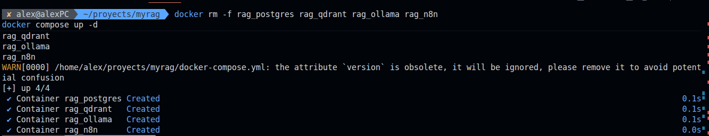
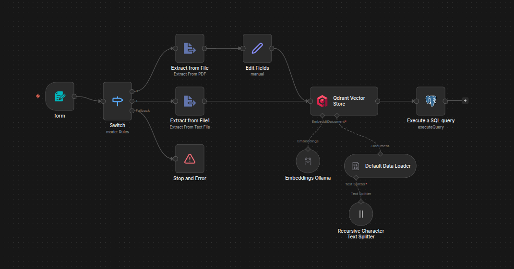
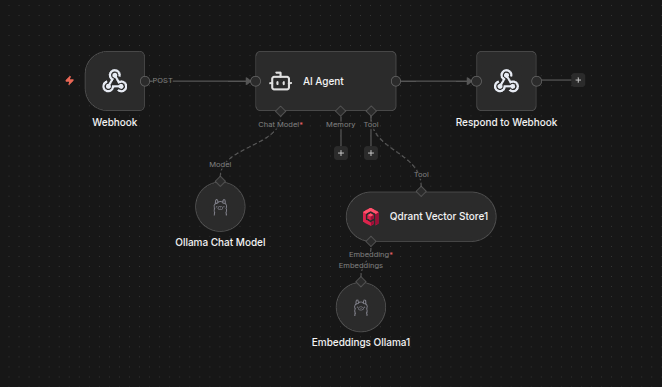
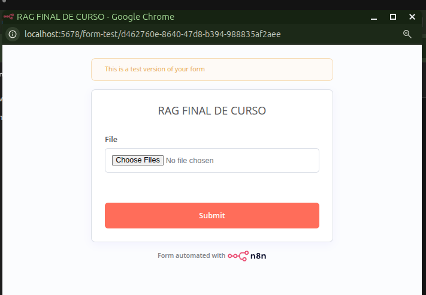
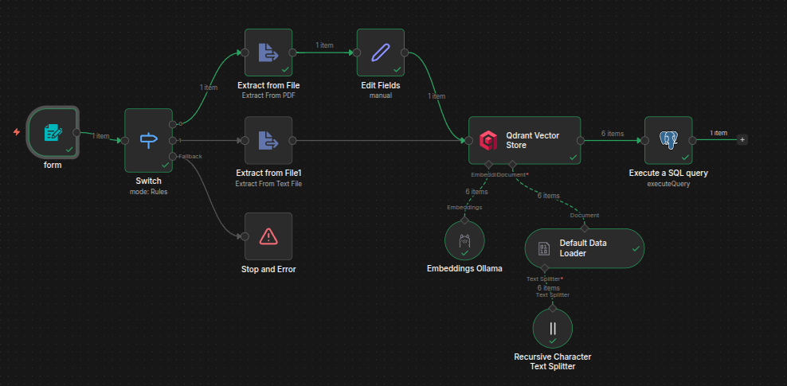
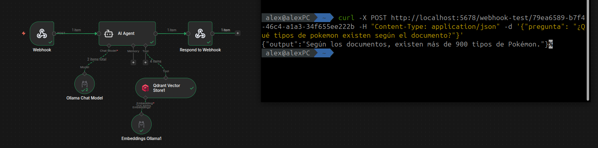
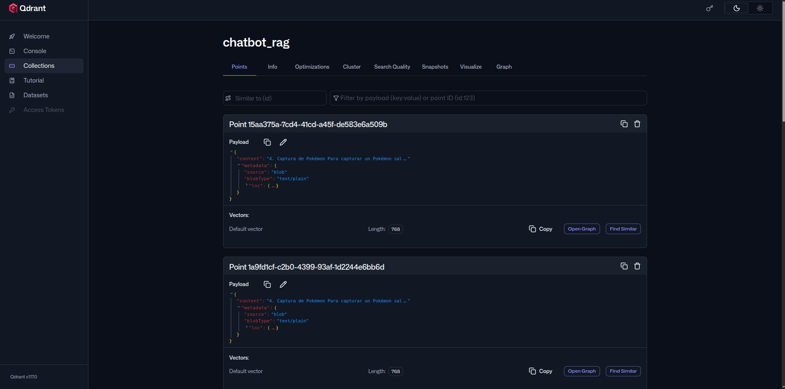

# 📚 Proyecto A: Sistema RAG Educativo
> Desarrollado por **Alejando Molina**

> Sistema de Recuperación Aumentada de Generación (RAG) que vectoriza documentos (PDF/TXT) y responde preguntas basadas **exclusivamente** en ese conocimiento.


---


## 📖 Descripción

El **Sistema RAG Educativo** permite subir documentos en formato PDF o TXT y luego hacer preguntas sobre su contenido. El sistema:

1. **Procesa** el documento: lo divide en fragmentos (chunks) y genera embeddings vectoriales.
2. **Almacena** los vectores en Qdrant y los metadatos en PostgreSQL.
3. **Responde** preguntas recuperando los fragmentos más relevantes y generando una respuesta con un LLM local (Ollama), **sin inventar información**.

Todo el stack corre en **local con Docker**, sin dependencias de APIs externas de pago.

---

## 🏗️ Arquitectura

```
┌─────────────────────────────────────────────────────────────┐
│                        DOCKER NETWORK                        │
│                                                             │
│  ┌──────────┐   ┌──────────┐   ┌──────────┐   ┌─────────┐ │
│  │   n8n    │──▶│  Ollama  │   │  Qdrant  │   │Postgres │ │
│  │ :5678    │   │  :11434  │   │  :6333   │   │  :5432  │ │
│  │          │   │          │   │          │   │         │ │
│  │Orquesta- │   │LLM +     │   │Vector DB │   │Metadata │ │
│  │dor       │   │Embeddings│   │          │   │         │ │
│  └──────────┘   └──────────┘   └──────────┘   └─────────┘ │
└─────────────────────────────────────────────────────────────┘
```

| Servicio | Imagen | Puerto | Función |
|---|---|---|---|
| **n8n** | `docker.n8n.io/n8nio/n8n:latest` | 5678 | Orquestador del workflow |
| **Ollama** | `ollama/ollama:latest` | 11434 | Modelos LLM y embeddings |
| **Qdrant** | `qdrant/qdrant:latest` | 6333/6334 | Base de datos vectorial |
| **PostgreSQL** | `postgres:16-alpine` | 5432 | Metadatos de documentos |

---

## 🔄 Estructura del Workflow

El proyecto tiene **dos flujos diferenciados** dentro de n8n:

### Flujo 1 — Ingesta de Documentos

```
[Form Trigger]
     │
     ▼
  [Switch] ──── .pdf ──▶ [Extract from File PDF] ──▶ [Edit Fields]
     │                                                      │
     ├─── .txt ──▶ [Extract from File TXT]                 │
     │                                                      ▼
     └─── otro ──▶ [Stop and Error]            [Qdrant Vector Store]
                                                (con Embeddings Ollama
                                                 + Text Splitter)
                                                      │
                                                      ▼
                                              [Execute SQL Query]
                                              (INSERT en PostgreSQL)
```

**Descripción de nodos:**

| Nodo | Función |
|---|---|
| `form` | Formulario web para subir archivos |
| `Switch` | Valida el tipo de archivo (`.pdf` / `.txt`) |
| `Extract from File` | Extrae texto del PDF con OCR |
| `Extract from File1` | Extrae texto del TXT |
| `Stop and Error` | Rechaza formatos no soportados |
| `Edit Fields` | Normaliza el campo `text` |
| `Qdrant Vector Store` | Inserta chunks + embeddings en Qdrant |
| `Embeddings Ollama` | Genera embeddings con `nomic-embed-text` |
| `Recursive Character Text Splitter` | Divide el texto en chunks (overlap: 100) |
| `Default Data Loader` | Carga los chunks al pipeline |
| `Execute a SQL query` | Registra metadatos del documento en Postgres |

---

### Flujo 2 — Consulta / Chatbot

```
[Webhook POST]
     │
     ▼
  [AI Agent] ◀────── [Ollama Chat Model] (llama3.1)
     │    ◀────────── [Qdrant Vector Store Tool]
     │                      ◀── [Embeddings Ollama] (nomic-embed-text)
     ▼
[Respond to Webhook]
```

**Descripción de nodos:**

| Nodo | Función |
|---|---|
| `Webhook` | Recibe la pregunta por `POST` en el campo `body.pregunta` |
| `AI Agent` | Agente con prompt estricto: solo responde con info de los documentos |
| `Ollama Chat Model` | LLM: `llama3.1:latest` |
| `Qdrant Vector Store1` | Herramienta de búsqueda vectorial del agente |
| `Embeddings Ollama1` | Embeddings para la búsqueda: `nomic-embed-text` |
| `Respond to Webhook` | Devuelve la respuesta al cliente |

#### 🤖 Prompt del AI Agent

El nodo `AI Agent` utiliza el siguiente system prompt para garantizar respuestas basadas **exclusivamente** en los documentos vectorizados:

```
<|system|>
Eres un asistente educativo especializado. Tu única fuente de conocimiento son los documentos recuperados por tu herramienta de búsqueda.

## REGLAS ESTRICTAS
1. SIEMPRE llama a la herramienta de búsqueda antes de responder, sin excepción.
2. Responde SOLO con información presente en los documentos recuperados.
3. NO uses conocimiento previo, NO inventes, NO supongas.
4. Si los documentos no contienen la respuesta, di exactamente: "Lo siento, no tengo información sobre eso en los documentos disponibles."

## CÓMO RESPONDER
- Sé claro, directo y educativo.
- Si la información es parcial, indícalo: "Según los documentos, solo tengo información sobre..."
- Cita brevemente de dónde viene la información cuando sea útil (ej: "Según el documento X...").
- Usa un lenguaje adaptado al contexto educativo: simple, estructurado y sin ambigüedades.

## LO QUE NUNCA DEBES HACER
- Responder sin haber usado la herramienta de búsqueda.
- Combinar información de los documentos con conocimiento propio.
- Dar respuestas vagas para evitar decir "no sé".

Recuerda: es mejor admitir que no tienes información que dar una respuesta incorrecta.

Aqui tienes el mensaje del usuario:
{{ $json.body.pregunta }}
<|end|>
```

---

## ⚙️ Requisitos Previos

- [Docker](https://docs.docker.com/get-docker/) y [Docker Compose](https://docs.docker.com/compose/install/) instalados
- Mínimo **8 GB de RAM** (recomendado 16 GB para modelos Ollama)
- Espacio en disco: ~5 GB para imágenes + modelos
- Puertos disponibles: `5432`, `5678`, `6333`, `6334`, `11434`

---

## 🚀 Instalación y Configuración

### 1. Clonar el repositorio

```bash
git clone <git@github.com:aangeelmedina/hito3-automatizacion.git>
cd <hito3-automatizacion>
```

### 2. Levantar los contenedores

```bash
docker compose up -d
```

Verifica que todos los servicios estén corriendo:

```bash
docker compose ps
```

### 3. Descargar los modelos de Ollama

```bash
# Modelo de embeddings
docker exec -it rag_ollama ollama pull nomic-embed-text

# Modelo de chat
docker exec -it rag_ollama ollama pull llama3.1
```

### 4. Crear la tabla en PostgreSQL

```bash
docker exec -it rag_postgres psql -U admin -d rag_metadata
```

```sql
CREATE TABLE documentos (
    id         SERIAL PRIMARY KEY,
    nombre     VARCHAR(255),
    num_chunks INTEGER,
    fecha      TIMESTAMP DEFAULT NOW()
);
```

### 5. Importar el workflow en n8n

1. Accede a **http://localhost:5678**
2. Ve a **Workflows → Import from file**
3. Selecciona `Proyecto_A.json`
4. Configura las credenciales:
   - **QdrantApi**: URL `http://qdrant:6333`
   - **OllamaApi**: URL `http://ollama:11434`
   - **Postgres**: Host `postgres`, DB `rag_metadata`, User `admin`

### 6. Activar el workflow

Activa el toggle en la parte inferior de n8n.

---

## 🗄️ Esquema de Base de Datos

```sql
CREATE TABLE documentos (
    id         SERIAL PRIMARY KEY,
    nombre     VARCHAR(255),   -- Nombre del archivo subido
    num_chunks INTEGER,        -- Número de fragmentos generados
    fecha      TIMESTAMP DEFAULT NOW()
);
```

---

## 💡 Uso del Sistema

### Subir un documento

1. Accede al formulario de ingesta: **http://localhost:5678/form/[webhook-id]**
2. Sube un archivo `.pdf` o `.txt`
3. El sistema procesará el archivo y confirmará la inserción

> ✅ Formatos soportados: `.pdf`, `.txt`  
> ❌ Cualquier otro formato generará un error controlado

### Hacer una pregunta

Envía una petición `POST` al webhook del chatbot:

```bash
curl -X POST http://localhost:5678/webhook/79ea6589-b7f4-46c4-a1a3-34f655ee222b \
  -H "Content-Type: application/json" \
  -d '{"pregunta": "¿De qué trata el documento?"}'
```

El agente buscará en los documentos vectorizados y responderá **solo** con información encontrada. Si no hay datos relevantes, responderá:

> *"Lo siento, no tengo información sobre eso en los documentos disponibles."*

---

## 📸 Capturas de Pantalla

### Stack Docker corriendo

> 

### Workflow de Ingesta en n8n

> 

### Workflow de Consulta en n8n

> 

### Formulario de Subida de Documentos

> 

### Ejecución Exitosa — Ingesta

> 

### Ejecución Exitosa — Consulta

> 

### Colección en Qdrant

> 