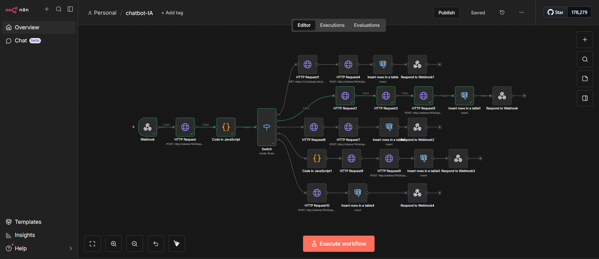
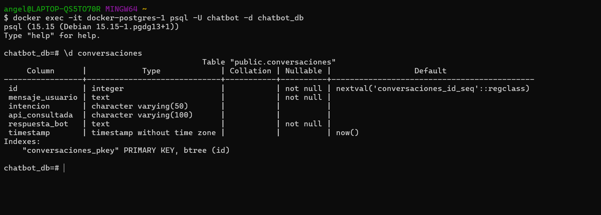

# 💬 PROYECTO B — Chatbot Multiherramienta
> Desarrollado por **Ángel Ortega**

Chatbot conversacional inteligente que analiza el mensaje del usuario y decide automáticamente qué herramienta externa consultar. El sistema clasifica la intención usando Ollama (Mistral), enruta a la API correspondiente y devuelve una respuesta natural al usuario. Todas las conversaciones quedan registradas en PostgreSQL.

---

## 🏗 Arquitectura

```
Usuario (POST /chatbot)
        ↓
    n8n Webhook
        ↓
  Ollama (Mistral) → Clasifica intención
        ↓
      Switch
    ↙  ↓  ↓  ↘  ↘
Chiste País Wiki Clima General
  ↓     ↓    ↓    ↓      ↓
JokeAPI REST  Wiki Open  Ollama
        Ctry  pedia Meteo directo
  ↓     ↓    ↓    ↓      ↓
  Ollama formatea respuesta natural
        ↓
    PostgreSQL (guarda conversación)
        ↓
    Respuesta al usuario
```

---

## 🛠 Stack Tecnológico

| Tecnología | Uso |
|-----------|-----|
| **n8n** | Orquestación visual de workflows |
| **Ollama + Mistral** | Clasificación de intenciones y generación de respuestas |
| **PostgreSQL 15** | Historial de conversaciones |
| **Docker + Docker Compose** | Containerización |
| **OpenMeteo** | API de clima (sin API key) |
| **REST Countries** | API de información de países (sin API key) |
| **Wikipedia API** | Resúmenes de conocimiento (sin API key) |
| **JokeAPI** | Chistes en español (sin API key) |

---

## 📁 Estructura del Proyecto

```
hito3-automatizacion/
├── docker/
│   ├── docker-compose.yml
│   ├── .env.example
│   └── .env                        ← NO versionado
├── n8n/
│   └── workflows/
│       ├── chatbot-multiherramienta.json   ← Proyecto B (Ángel)
│       ├── rag-ingesta.json                ← Proyecto A (Alejandro)
│       └── rag-consultas.json             ← Proyecto A (Alejandro)
├── postgres/
│   └── init.sql
├── tests/
│   └── pruebas.http
├── docs/
│   └── capturas/
│       ├── workflow-n8n.png
│       ├── tabla-postgresql.png
│       └── ...capturas RAG
├── .gitignore
└── README.md
```

---

## 🚀 Instalación y Ejecución

### Requisitos previos

- Docker 24+ y Docker Compose V2
- Ollama instalado con modelo Mistral descargado

```bash
ollama pull mistral
```

### Pasos

**1. Clonar el repositorio**
```bash
git clone <url-del-repositorio>
cd hito3-automatizacion
```

**2. Configurar variables de entorno**
```bash
cp docker/.env.example docker/.env
```

**3. Levantar los servicios**
```bash
cd docker
docker compose up --build -d
```

**4. Verificar que todo está corriendo**
```bash
docker compose ps
```

Deberías ver:
```
NAME                  STATUS
docker-n8nIA-1        running   (puerto 5679)
docker-postgres-1     running   (puerto 5432)
```

**5. Importar el workflow en n8n**

- Entra a http://localhost:5679
- Ve a **Workflows → Import**
- Selecciona `n8n/workflows/chatbot-multiherramienta.json`
- Activa el workflow con el toggle

**6. Crear la tabla en PostgreSQL**
```bash
docker exec -it docker-postgres-1 psql -U chatbot -d chatbot_db
```
```sql
CREATE TABLE conversaciones (
  id SERIAL PRIMARY KEY,
  mensaje_usuario TEXT NOT NULL,
  intencion VARCHAR(50),
  api_consultada VARCHAR(100),
  respuesta_bot TEXT NOT NULL,
  timestamp TIMESTAMP DEFAULT NOW()
);
```

---

## 🧪 Pruebas

Archivo completo en `tests/pruebas.http`. Ejemplos rápidos:

**Clima**
```bash
curl -X POST http://localhost:5679/webhook/chatbot \
  -H "Content-Type: application/json" \
  -d '{"mensaje": "que tiempo hace en Madrid"}'
```

**País**
```bash
curl -X POST http://localhost:5679/webhook/chatbot \
  -H "Content-Type: application/json" \
  -d '{"mensaje": "dime algo sobre Japon"}'
```

**Wikipedia**
```bash
curl -X POST http://localhost:5679/webhook/chatbot \
  -H "Content-Type: application/json" \
  -d '{"mensaje": "quien fue Einstein"}'
```

**Chiste**
```bash
curl -X POST http://localhost:5679/webhook/chatbot \
  -H "Content-Type: application/json" \
  -d '{"mensaje": "cuentame un chiste"}'
```

**General**
```bash
curl -X POST http://localhost:5679/webhook/chatbot \
  -H "Content-Type: application/json" \
  -d '{"mensaje": "como estas hoy"}'
```

---

## 🗄️ Base de Datos

### Tabla `conversaciones`

| Campo | Tipo | Descripción |
|-------|------|-------------|
| id | SERIAL PK | Identificador autoincremental |
| mensaje_usuario | TEXT | Mensaje original del usuario |
| intencion | VARCHAR(50) | Intención detectada por Ollama |
| api_consultada | VARCHAR(100) | API utilizada para responder |
| respuesta_bot | TEXT | Respuesta generada |
| timestamp | TIMESTAMP | Fecha y hora de la conversación |

### Ver conversaciones guardadas
```bash
docker exec -it docker-postgres-1 psql -U chatbot -d chatbot_db
```
```sql
SELECT id, mensaje_usuario, intencion, timestamp 
FROM conversaciones 
ORDER BY timestamp DESC 
LIMIT 10;
```

---

## 📸 Capturas

### Workflow en n8n


### Tabla PostgreSQL con conversaciones


---

## 🔀 Workflow detallado

El workflow consta de los siguientes nodos principales:

**1. Webhook** — Recibe el mensaje del usuario via POST en `/chatbot`

**2. Ollama clasificador** — Analiza la intención y devuelve JSON con `intencion` y `ubicacion` (si aplica)

**3. Code (parser)** — Parsea y limpia el JSON de Ollama, extrae `mensaje_original`

**4. Switch** — Enruta a la rama correcta según la intención detectada

**5. Ramas de APIs:**
- **Chiste** → JokeAPI → Ollama formatea → Respond
- **Clima** → Nominatim (geocoding) → OpenMeteo → Ollama formatea → Respond
- **País** → Code (extrae país) → REST Countries → Ollama formatea → Respond
- **Wikipedia** → Code (extrae tema) → Wikipedia API → Ollama formatea → Respond
- **General** → Ollama responde directamente → Respond

**6. PostgreSQL** — Guarda cada conversación antes de responder

---

## ⚙️ Variables de Entorno

Copia `.env.example` a `.env` y ajusta los valores:

```env
N8N_USER=admin
N8N_PASSWORD=admin123
POSTGRES_USER=chatbot
POSTGRES_PASSWORD=chatbot123
POSTGRES_DB=chatbot_db
```

> ⚠️ El archivo `.env` nunca debe subirse al repositorio.

---


## 📚 APIs Utilizadas

| API | URL | Autenticación |
|-----|-----|---------------|
| OpenMeteo | https://api.open-meteo.com | Sin API key |
| Nominatim | https://nominatim.openstreetmap.org | Sin API key |
| REST Countries | https://restcountries.com/v3.1 | Sin API key |
| Wikipedia ES | https://es.wikipedia.org/api/rest_v1 | Sin API key |
| JokeAPI | https://v2.jokeapi.dev | Sin API key |

---

## 🧩 Dificultades y Soluciones (Proyecto B)

**Ollama en Docker no conectaba** — Solución: usar `host.docker.internal` en lugar de `localhost` para acceder a Ollama desde el contenedor n8n.

**Ollama explicaba los chistes** — Solución: rediseño del prompt indicando que es un "mensajero" que solo repite el chiste sin comentarlo.

**JokeAPI devuelve el chiste en 1 o 2 partes** — Solución: expresión condicional `$json.joke ? $json.joke : $json.setup + " ... " + $json.delivery`.

**REST Countries no encontraba países en español** — Solución: diccionario de traducción español → inglés en nodo Code antes de llamar a la API.

**Wikipedia devolvía 403 Forbidden** — Solución: añadir header `User-Agent` al HTTP Request.

**PostgreSQL con error de clave duplicada** — Solución: recrear la tabla con `SERIAL PRIMARY KEY` correcto para que el autoincremento funcione bien.
